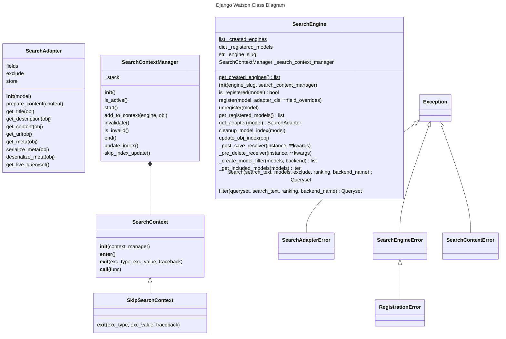
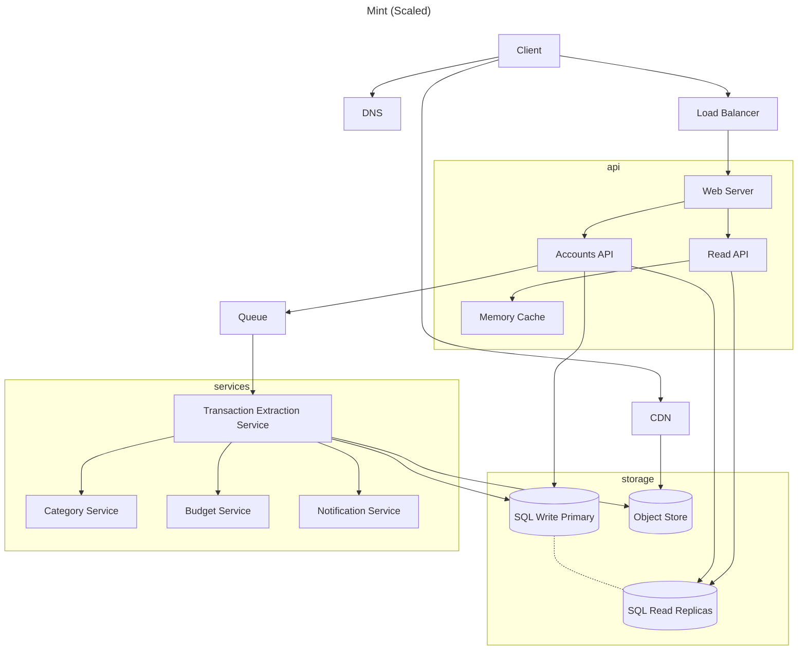
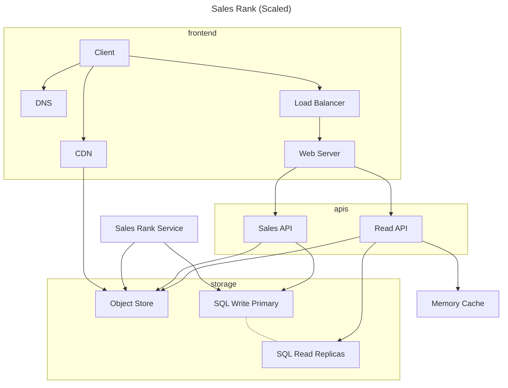
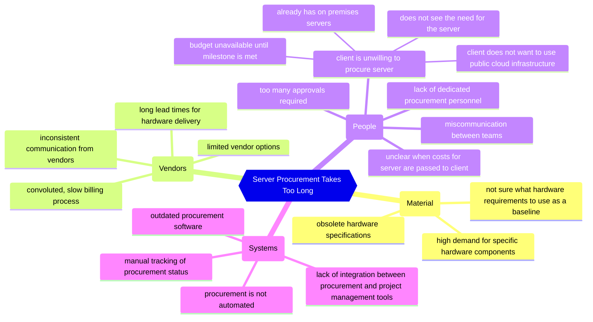
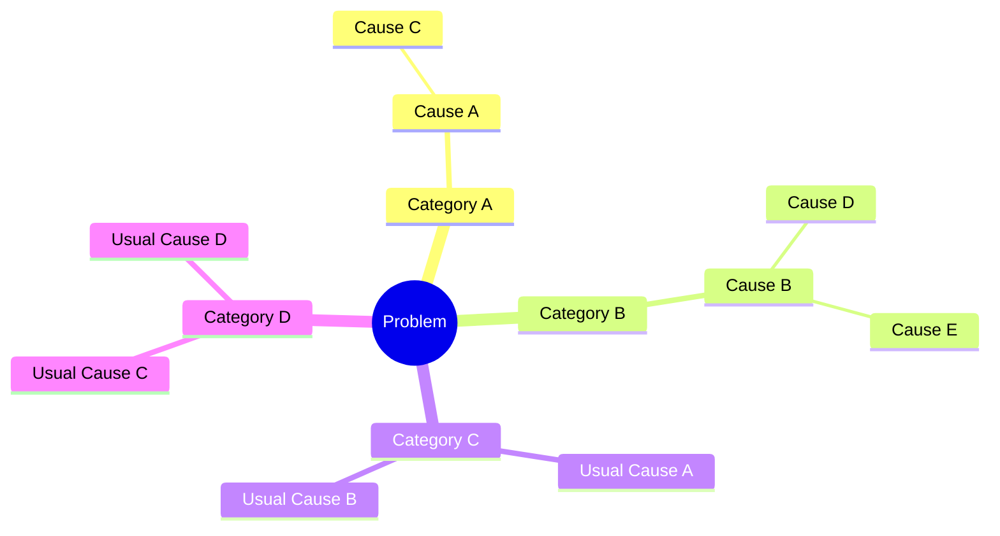

# Mermaid

[HABR: Рисуем диаграммы Mermaid.js в README-файлах GitHub](https://habr.com/ru/articles/652867/)

**Mermaid - это простой язык для составления диаграмм, чартов и тп**

> Полезно использовать [Mermaid online redactor](https://mermaid-js.github.io/mermaid-live-editor/beta/edit)

[Mermaid Diagrams Types](https://mermaid.js.org/intro/#diagram-types):
* Flowchart
    ```mermaid
    ---
        title: Example Flowchart diagram
    ---
    graph TD
        A[Christmas] -->|Get money| B(Go shopping)
        B --> C{Let me think}
        C -->|One| D[Laptop]
        C -->|Two| E[iPhone]
        C -->|Three| F[fa:fa-car Car]
    ```
* Sequence diagram
    ```mermaid
    ---
    title: Example Flowchart diagram
    ---
    sequenceDiagram
        Alice->>+John: Hello John, how are you?
        Alice->>+John: John, can you hear me?
        John-->>-Alice: Hi Alice, I can hear you!
        John-->>-Alice: I feel great!
    ```
* Class diagram
    ```mermaid
    ---
    title: Example Class diagram
    ---
    classDiagram
        Animal <|-- Duck
        Animal <|-- Fish
        Animal <|-- Zebra
        Animal : +int age
        Animal : +String gender
        Animal: +isMammal()
        Animal: +mate()
        class Duck{
        +String beakColor
        +swim()
        +quack()
        }
        class Fish{
        -int sizeInFeet
        -canEat()
        }
        class Zebra{
        +bool is_wild
        +run()
        }   
    ```
* State diagram
    ```mermaid
    ---
    title: Example State diagram
    ---
    stateDiagram-v2
        [*] --> Still
        Still --> [*]
        Still --> Moving
        Moving --> Still
        Moving --> Crash
        Crash --> [*]
    ```
* Gantt diagram
    ```mermaid
    ---
    title: Example Gantt diagram
    ---
    gantt
        title A Gantt Diagram
        dateFormat  YYYY-MM-DD
        section Section
        A task           :a1, 2014-01-01, 30d
        Another task     :after a1  , 20d
        section Another
        Task in sec      :2014-01-12  , 12d
        another task      : 24d
    ```
* Entity Relationship Diagram
    ```mermaid
    ---
    title: Example Entity Relationship diagram
    ---
    erDiagram
          CUSTOMER }|..|{ DELIVERY-ADDRESS : has
          CUSTOMER ||--o{ ORDER : places
          CUSTOMER ||--o{ INVOICE : "liable for"
          DELIVERY-ADDRESS ||--o{ ORDER : receives
          INVOICE ||--|{ ORDER : covers
          ORDER ||--|{ ORDER-ITEM : includes
          PRODUCT-CATEGORY ||--|{ PRODUCT : contains
          PRODUCT ||--o{ ORDER-ITEM : "ordered in"
    ```
* Git graph
    ```mermaid
    ---
    title: Example Git diagram
    ---
    gitGraph
        commit
        commit
        branch develop
        checkout develop
        commit
        commit
        checkout main
        merge develop
        commit
        commit
    ```
* User Journey Diagram
    ```mermaid
    ---
    title: Example User Journey diagram
    ---
    journey
        title My working day
        section Go to work
        Make tea: 5: Me
        Go upstairs: 3: Me
        Do work: 1: Me, Cat
        section Go home
        Go downstairs: 5: Me
        Sit down: 3: Me
    ```
* Pie chart
    ```mermaid
    ---
    title: Example Pie chart diagram
    ---
    pie title Pets adopted by volunteers
        "Dogs" : 386
        "Cats" : 85
        "Rats" : 15
    ```
* Quadrant Chart
    ```mermaid
    ---
    title: Example Quadrant Chart diagram
    ---
    quadrantChart
        title Reach and engagement of campaigns
        x-axis Low Reach --> High Reach
        y-axis Low Engagement --> High Engagement
        quadrant-1 We should expand
        quadrant-2 Need to promote
        quadrant-3 Re-evaluate
        quadrant-4 May be improved
        Campaign A: [0.3, 0.6]
        Campaign B: [0.45, 0.23]
        Campaign C: [0.57, 0.69]
        Campaign D: [0.78, 0.34]
        Campaign E: [0.40, 0.34]
        Campaign F: [0.35, 0.78]
    ```
* XY Chart
    ```mermaid
    ---
    title: Example XY Chart diagram
    ---
    xychart-beta
        title "Sales Revenue"
        x-axis [jan, feb, mar, apr, may, jun, jul, aug, sep, oct, nov, dec]
        y-axis "Revenue (in $)" 4000 --> 11000
        bar [5000, 6000, 7500, 8200, 9500, 10500, 11000, 10200, 9200, 8500, 7000, 6000]
        line [5000, 6000, 7500, 8200, 9500, 10500, 11000, 10200, 9200, 8500, 7000, 6000]
    ```

# Примеры использования

## Class Diagmar Example




## System Design Example

### [Mint](https://github.com/donnemartin/system-design-primer/tree/master/solutions/system_design/mint)



### [Sales Rank](https://github.com/donnemartin/system-design-primer/tree/master/solutions/system_design/sales_rank)



### Пример диаграммы Причин и Следствия


Пример проблем и первопричин:



---

[1.2.1 Markdown Folder Theme](../1.2.1%20Markdown/) | [Back To iOSWiki Contents](https://github.com/eldaroid/iOSWiki) |  [1.2.2 About Git Theme](./1.2.2%20Git.md)
