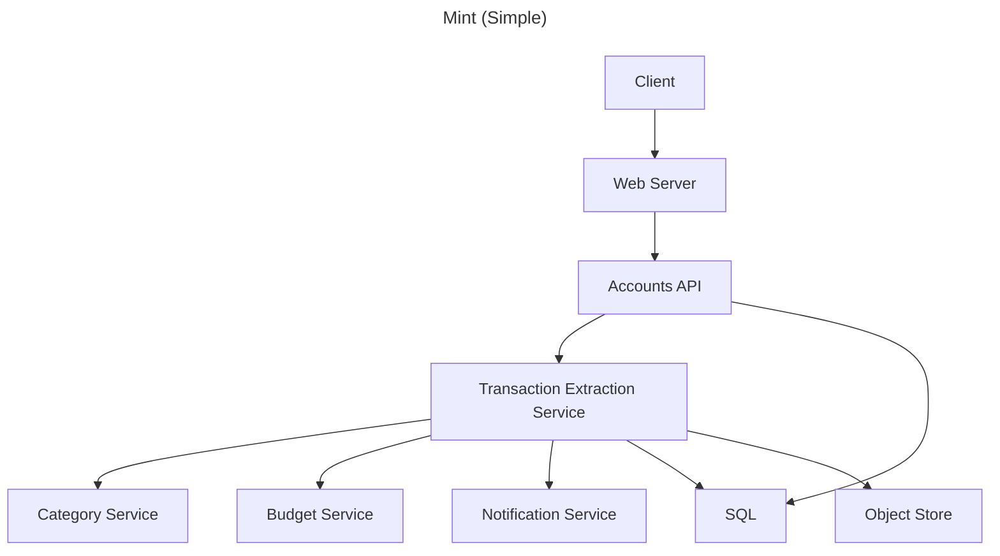

# Mermaid

Mermaid - это простой язык для составления диаграмм, чартов и тп

```mermaid
---
title: Mint (Simple)
---
graph TB
Client --> web[Web Server] --> accounts[Accounts API]
accounts --> tes[Transaction Extraction Service] --> category[Category Service] & budget[Budget Service] & notif[Notification Service]
accounts --> db
tes --> db[SQL]
tes --> store[Object Store]
```

